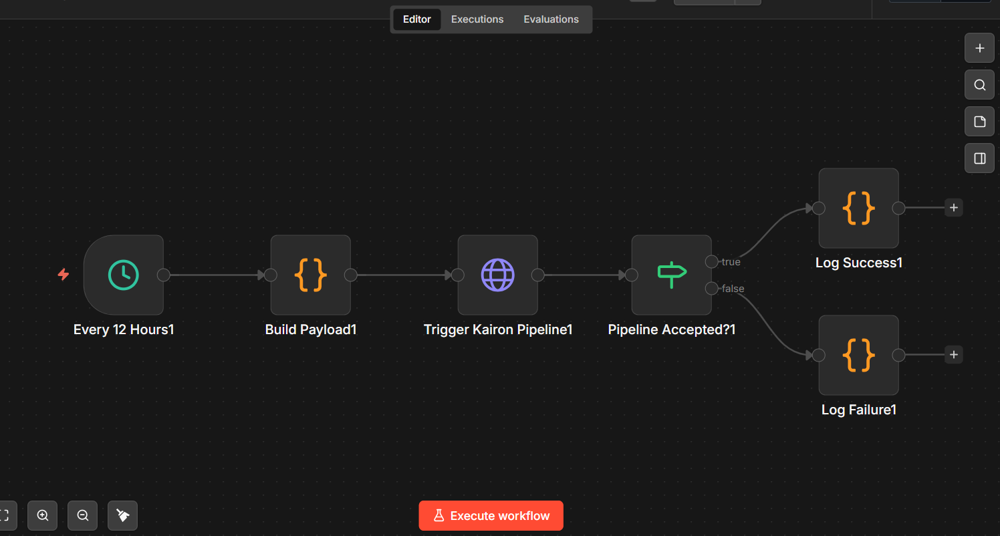
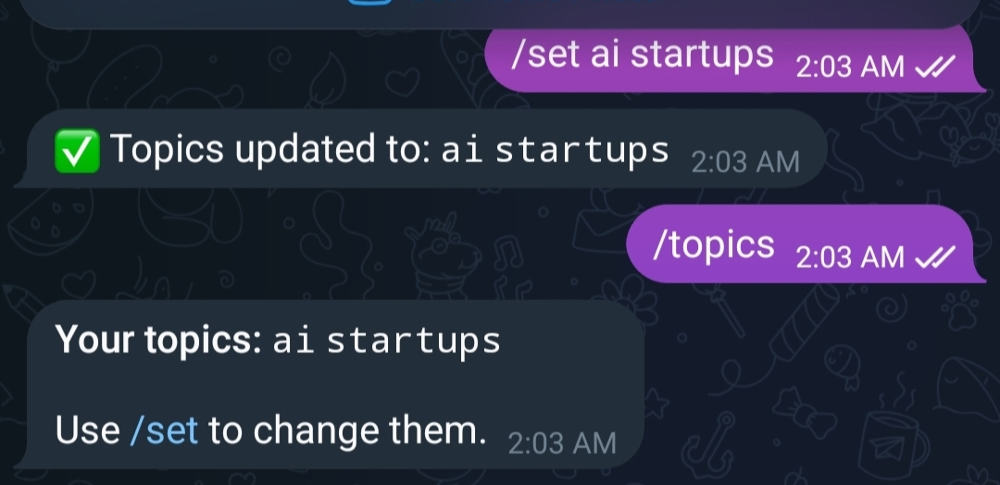
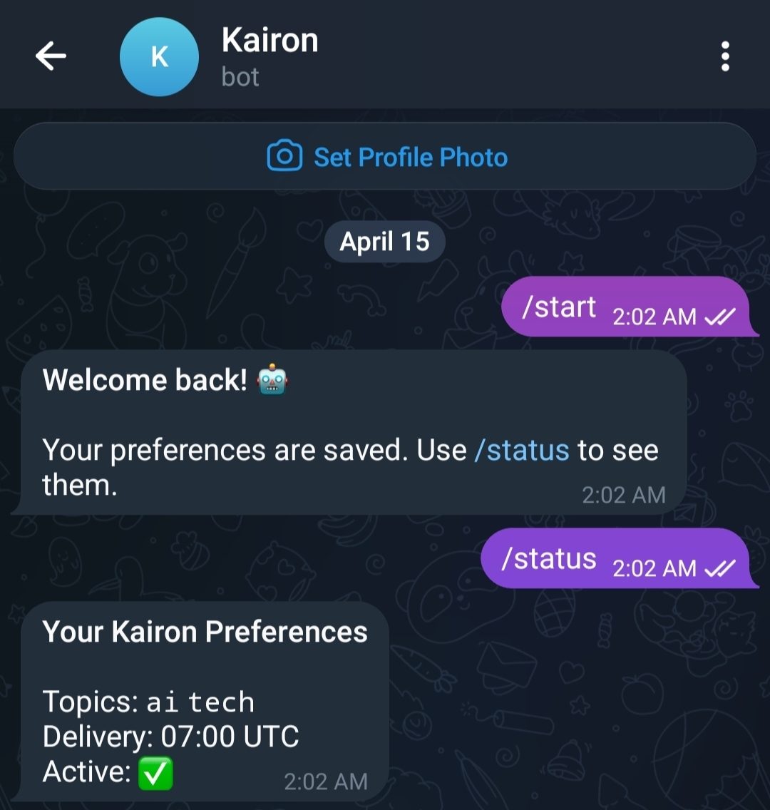
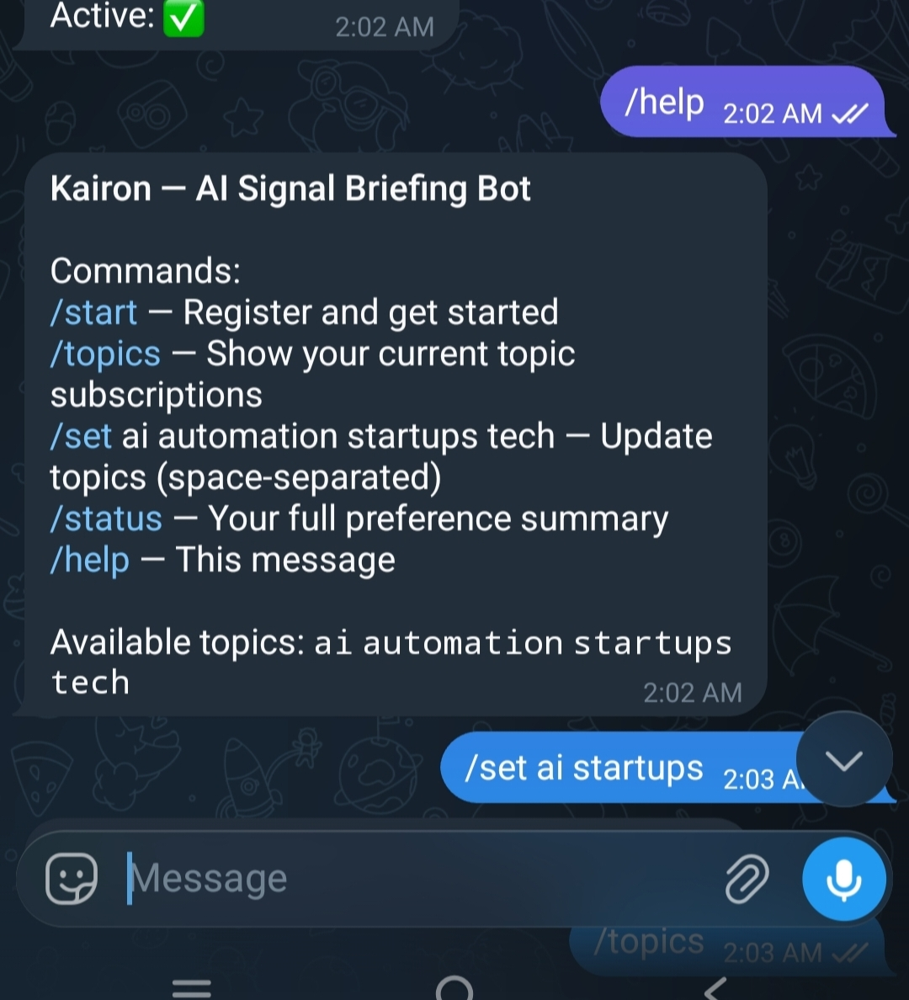
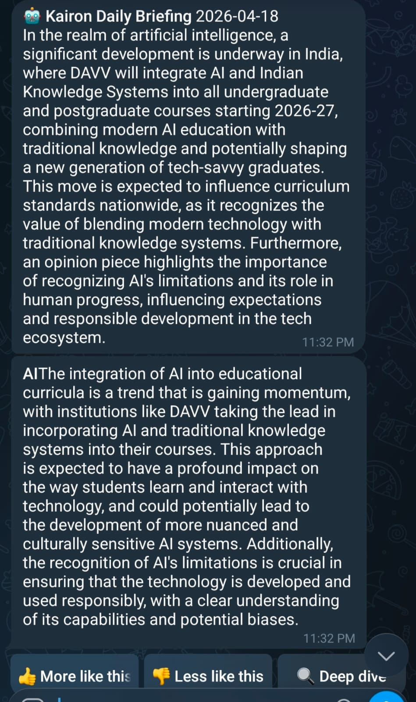
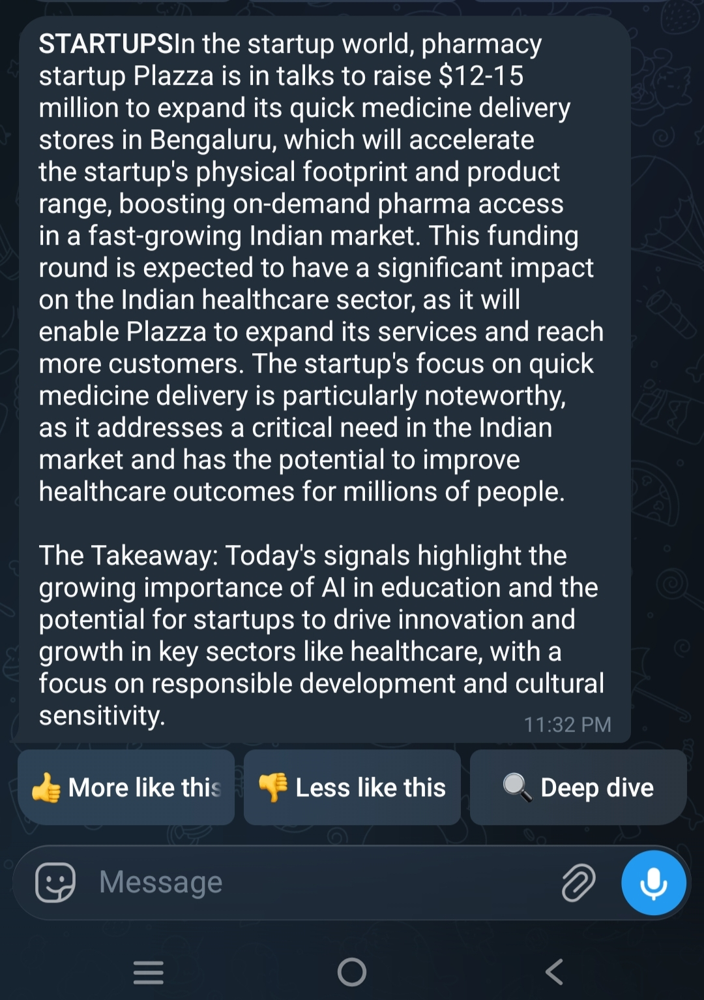

# Kairon 🤖

**AI-powered signal briefing bot delivered via Telegram.**

<p align="left">
  
  
  
  
  
</p>

Kairon fetches articles from multiple free news APIs, runs a LangGraph-orchestrated pipeline to extract signal intelligence, synthesizes a daily briefing using a cloud LLM, and delivers it to your Telegram on a 12-hour schedule.

> Built by [Siddharth Lal](https://linkedin.com/in/siddharth-lal-606128200)

---

## What it does

Every 12 hours, n8n triggers the pipeline:

```
NewsAPI + GNews + HN + Ars Technica
         │
         ▼
LangGraph Supervisor (Fetcher → Analyzer → Synthesizer)
         │
         ▼
Telegram — analyst-style briefing on AI, Automation, Startups, Tech
```

The pipeline is **supervisor-routed**: after each stage, a conditional edge evaluates data quality and either retries or proceeds — no hardcoded pass-throughs. The Telegram bot is two-way: send `/set ai startups` to change your topics without touching any config file.

---

## Architecture

```
┌──────────────────────────────────────────────────────────────┐
│  n8n (Docker, port 5678)                                     │
│  12-hour ScheduleTrigger → POST /trigger                     │
└───────────────────────────┬──────────────────────────────────┘
                            │
┌───────────────────────────▼──────────────────────────────────┐
│  FastAPI (Uvicorn, port 8000)                                │
│  /trigger  — pipeline entrypoint (async background task)     │
│  /bot      — Telegram webhook receiver                       │
│  /health   — liveness probe                                  │
└──────┬────────────────────────────────────────┬──────────────┘
       │                                        │
┌──────▼───────────────┐            ┌───────────▼─────────────┐
│  LangGraph Pipeline  │            │  Telegram Bot (PTB v21) │
│                      │            │                         │
│  fetch_node          │            │  /start  /topics        │
│  ├─ NewsAPI          │            │  /set    /status        │
│  └─ GNews            │            │  /help                  │
│  ├─ HN scraper       │            │                         │
│  └─ Ars scraper      │            │  Inline feedback        │
│                      │            │  👍 👎 🔍               │
│  ── quality gate ──  │            └─────────────────────────┘
│                      │
│  analyze_node        │
│  LangChain LCEL      │◄── Local LLM via Ollama
│  Structured output   │
│                      │
│  ── quality gate ──  │
│                      │
│  synthesize_node     │◄── Cloud LLM (free tier)
│  Final briefing      │
└──────┬───────────────┘
       │
┌──────▼───────────┐
│  Storage         │
│  preferences     │  flat JSON
│  delivery_log    │  flat JSON
│  feedback_log    │  flat JSON
└──────────────────┘
```

### Design decisions worth noting

- Cost-Optimized Dual-LLM: A small local model (Ollama) handles per-article structured extraction in parallel (keeping high-volume analysis free), while the cloud model (Llama-3.3-70b via NIM) only runs once for final synthesis where reasoning actually matters.

- Self-Healing Supervisor Pattern: The LangGraph pipeline uses conditional routing rather than hardcoded pass-throughs. If the fetch stage returns low-quality data, the supervisor evaluates the quality gate and automatically triggers retries with adjusted parameters, ensuring the pipeline degrades gracefully.

- Hybrid Data Sourcing: APIs (NewsAPI, GNews) provide structured metadata, while concurrent web scrapers (crawl4ai) pull engagement signals from Hacker News and Ars Technica. The pipeline handles intelligent deduplication and merging across all sources.

---

### Tech stack

| Component | Technology | Notes |
|-----------|-----------|-------|
| Orchestration | n8n (self-hosted Docker) | 12-hour cron, importable `workflow.json` |
| News sources | NewsAPI + GNews | Free tiers stacked for volume |
| Web Scraping | crawl4ai + BeautifulSoup | Hacker News + Ars Technica |
| Pipeline | LangGraph 0.2+ | Supervisor pattern, conditional retry edges |
| Analysis LLM | Ollama (local) | Structured extraction, parallel calls |
| Synthesis LLM | Cloud API (free tier) | Final briefing generation |
| Bot | python-telegram-bot v21 | Two-way, inline callbacks |
| API layer | FastAPI + Uvicorn | Webhook bridge |
| Data models | Pydantic v2 | End-to-end type safety |
| Storage | JSON flat files | See Stage 2 roadmap |
| Containerisation | Docker + Docker Compose | `docker compose up` |

---

## Prerequisites

- **Python 3.11+**
- **Docker Desktop**
- **Ollama** installed on the host machine with a small model pulled (see `.env.example` for model name)
- Free API keys: [NewsAPI](https://newsapi.org/register), [GNews](https://gnews.io/), cloud LLM provider of choice
- Telegram bot token from [@BotFather](https://t.me/BotFather)

---

## Quick start

```bash
# 1. Clone
git clone https://github.com/Siddharth-lal-13/Kairon-Signal-Bot.git
cd Kairon-Signal-Bot

# 2. Set up environment
cp .env.example .env
# Fill in API keys

# 3. Create storage files
mkdir -p storage
echo '{}' > storage/preferences.json
echo '[]' > storage/delivery_log.json
echo '[]' > storage/feedback_log.json

# 4. Start services
docker compose up -d

# 5. Import n8n workflow
# Open http://localhost:5678 → Workflows → Import → n8n/workflow.json
# Activate the workflow.

# 6. Test
# Find your bot on Telegram, send /start
```

### Manual trigger (skip n8n)

```bash
curl -X POST http://localhost:8000/trigger \
  -H "Content-Type: application/json" \
  -H "X-N8n-Secret: your_n8n_trigger_secret" \
  -d '{"run_id": "test-001", "triggered_at": "2025-01-01T07:00:00Z", "target_user_id": YOUR_CHAT_ID}'
```

### Development mode (no Docker)

```bash
pip install -r requirements.txt
uvicorn api.webhook:app --reload --port 8000
# In a second terminal:
python -m bot.telegram_bot
```

---

## Telegram commands

| Command | Description |
|---------|-------------|
| `/start` | Register and receive briefing setup |
| `/topics` | Show current subscriptions |
| `/set ai automation` | Update subscriptions (space-separated) |
| `/status` | Full preference summary |
| `/help` | Command reference |

Available topics: `ai` `automation` `startups` `tech`

Each briefing includes inline 👍 / 👎 feedback buttons. Upvotes and downvotes adjust signal-type and entity weights for future briefings, stored in `feedback_log.json`.

---

## Project structure

```
Kairon-Signal_Bot/
├── agents/
│   ├── fetcher.py       # Async news fetcher — NewsAPI + GNews, deduped
│   ├── scraper.py       # crawl4ai scraper — Hacker News + Ars Technica
│   ├── analyzer.py      # LangChain LCEL → local LLM, structured extraction
│   ├── pipeline.py      # LangGraph graph — supervisor + conditional edges
│   └── synthesizer.py   # Cloud LLM synthesis
├── bot/
│   └── telegram_bot.py  # PTB v21, two-way, inline callbacks
├── api/
│   └── webhook.py       # FastAPI — /trigger /bot /health
├── models/
│   └── schemas.py       # Pydantic v2 models
├── storage/
│   └── store.py         # Flat-file storage layer
├── n8n/
│   └── workflow.json    # Importable n8n workflow
├── .env.example
├── docker-compose.yml
├── Dockerfile
└── requirements.txt
```

> **Note:** Core agent implementation files are not public to protect the commercial roadmap. The architecture, schemas, API layer, and n8n workflow are fully available. Screenshots below show the system running end-to-end.

---

## Screenshots


<p align="center">
  
  
  
  
  
</p>

---

## Configuration

All configuration via environment variables. See `.env.example`.

| Variable | Description |
|----------|-------------|
| `NEWSAPI_KEY` | NewsAPI free tier |
| `GNEWS_KEY` | GNews free tier |
| `TELEGRAM_BOT_TOKEN` | From @BotFather |
| `OLLAMA_MODEL` | Local model name |
| `OLLAMA_BASE_URL` | Ollama endpoint (default: `http://host.docker.internal:11434`) |
| `MAX_CONCURRENT_LLM` | Parallel analysis calls (default: `2`) |
| `RELEVANCE_THRESHOLD` | Drop articles below this score (default: `0.4`) |
| `N8N_TRIGGER_SECRET` | Shared secret between n8n and FastAPI |

---

## n8n workflow

`n8n/workflow.json` is directly importable.

What it does: fires every 12 hours → builds a `run_id` payload → POSTs to `/trigger` with the shared secret → logs success or failure.

Import: n8n UI → Workflows → ··· → Import from file → `n8n/workflow.json`

---

## Roadmap

See [STAGE2.md](STAGE2.md) for the planned commercial evolution of Kairon Signal Bot.

---

## License

[PolyForm Noncommercial 1.0](LICENSE)

Free to use, study, and modify for non-commercial purposes with attribution. Commercial use requires written permission from the author.

---

## Author

**Siddharth Lal** — Python backend, AI, data and automation engineer  
[GitHub](https://github.com/Siddharth-lal-13) · [LinkedIn](https://linkedin.com/in/siddharth-lal-606128200)
